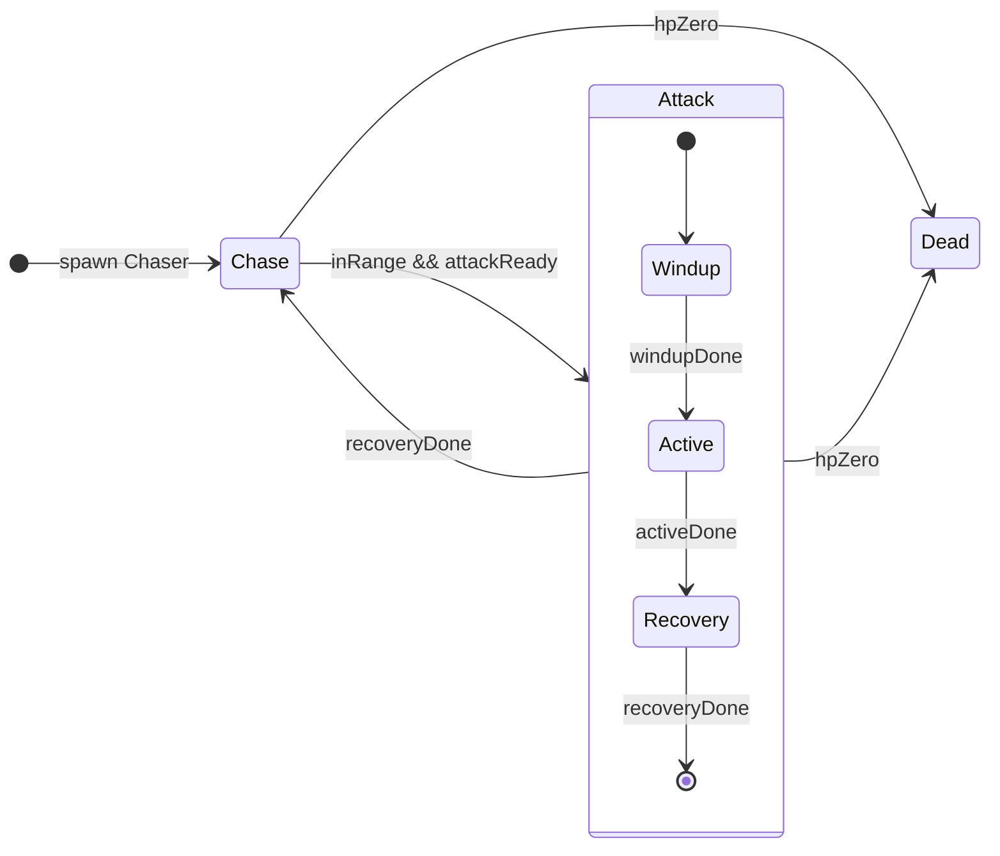
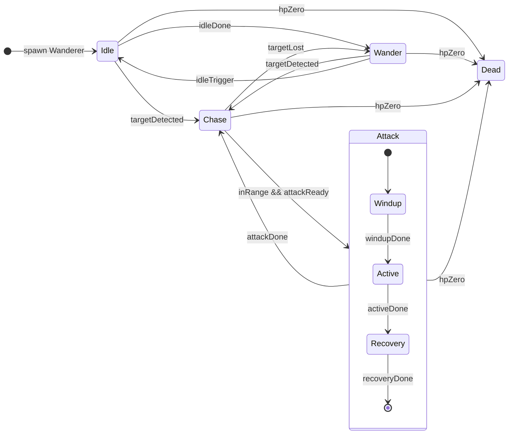

## LOST HAUNTED FOREST

**CONCEPT**

Vous incarner un chasseur qui s'est égaré dans une forêt maudite.
Des hordes rempli de squelettes et de chauve-souris vous attaqueront sans cesse.
Dans ce Horde Survivor, le but est de battre le plus de monstres possible afin d'obtenir le plus grand score. 
Il vous faudra réussir à optimiser vos déplacements et bien gérer la distance de vos attaques pour rester en vie. La fin est proche pour vous… Mais combien de monstres emporterez vous dans la tombe ? 

✅ FONCTIONNALITÉS RÉALISÉES

Nous avons développé un système permettant de générer à l’infini deux types d’ennemis :

Un ennemi rapide mais fragile (Chaser / Chauve-souris)

Un ennemi plus lent mais plus résistant (Wanderer / Squelette)

La différence principale entre eux réside dans leur comportement.

Grâce à une Finite State Machine (FSM), les ennemis disposent des états suivants :

Idle

Wander

Chase

Attack

Dead

Chaque état possède ses propres conditions de transition.

🔹 ÉTAT IDLE

État neutre

L’entité reste immobile

🔹 ÉTAT WANDER

Déplacement aléatoire

Possède une zone de détection

Si le joueur entre dans cette zone → transition vers Chase

🔹 ÉTAT CHASE

L’ennemi poursuit le joueur

Si le joueur sort du rayon de poursuite → retour en Wander

Si le joueur entre dans le rayon d’attaque → transition vers Attack

⚠️ Cas particulier :
La Chauve-souris (Chaser) commence directement en Chase et ne possède pas d’état Idle ou Wander.

🔹 ÉTAT ATTACK

Permet d’infliger des dégâts au joueur

Composé de trois sous-états :

Windup (préparation)

Active (attaque effective)

Recovery (temps de récupération)

🔹 ÉTAT DEAD

Supprime l’ennemi de l’écran

Libère sa mémoire

Permet le respawn d’autres ennemis (nombre maximum simultané limité)

**FONCTIONNALITES NON REALISES**

Nous n'avons pas réussi à implémenter les fonctionnement que nous voulions pour les armes.
On voulait que le joueur puisse récupérer différents bonus qui ajoute des armes passives autour du joueur pour avoir un sentiment de monter de puissance. 
On voulait aussi que les armes deviennent de plus en plus puissantes quand on ramasse plusieurs fois le même type.
Mais par faute de temps nous avons privilégier le fonctionnement des ennemies.
Dans le build jouable, le personnage possède uniquement une épée pour attaquer ses adversaires.

**SCHEMA DE LA FSM**

## 👹 Chaser (Bat)

## 🌲 Wanderer (Green / Blue)

**SOURCE ASSET**

 https://legnops.itch.io/red-hood-character
itch.io
Red hood pixel character by Legnops
Free smooth pixel character

https://luizmelo.itch.io/monsters-creatures-fantasy
itch.io
Monsters Creatures Fantasy by LuizMelo

https://flowfrog101.itch.io/free-bat-enemy-spritesheet
itch.io
Free Bat-Enemy Spritesheet by FlowFrog101
Top down animated sprite
